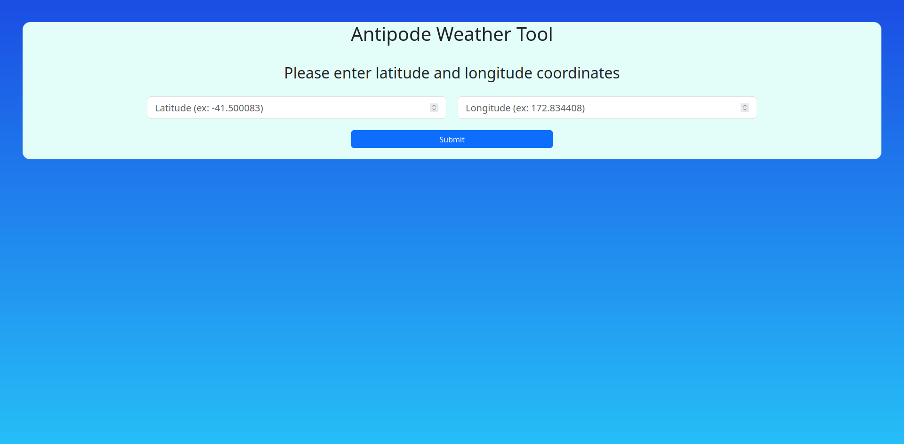
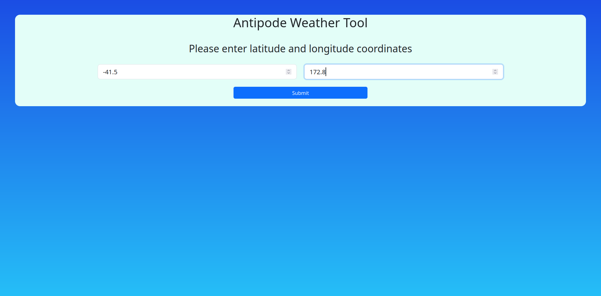
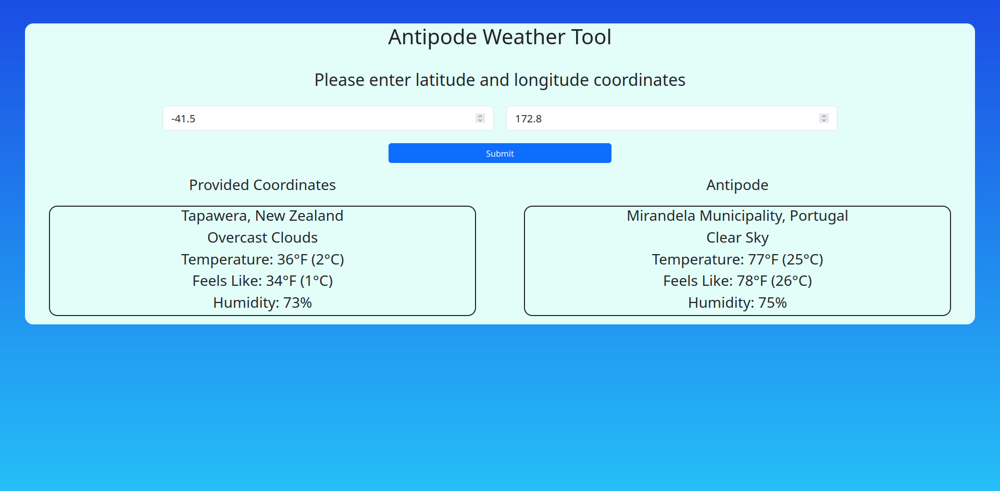
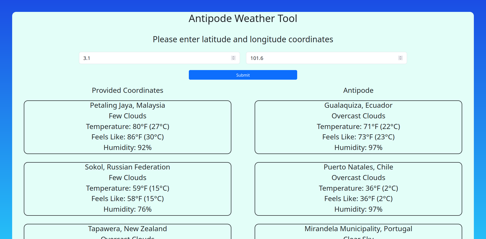

# Antipode Weather Tool
A web application that provides weather data of specified coordinates, and the weather data of it's antipode.

## Objective
The purpose of this web application is to provide a simple way to get weather data of a location and the weather data from the exact opposite side of the world, in case you ever wondered hows the weather at the end of a tunnel through the center of the world.

## Open Weather API Usage
The Open Weather API was used to fetch current weather data. Latitude and longitude values are needed to make a request, which are provided by the user. And the antipode coordinates are calculated using the following equation: -(180 - |coordinate|)

## How to Use the Project
1. Once the webpage is deployed, you can enter latitude and longitude values into the corresponding input fields

2. Once you enter in the coordinates, you can then click the Submit button. The app will make a request to the Open Weather API endpoint, and return current weather data. The information will be displayed below the Submit button

3. You can enter various coordinates where the latest requested weather information will be shown on the top

## Future Improvements

### Web Hosting
Currently the web app is not deployed on any server host. The web app will be hosted at a future date.